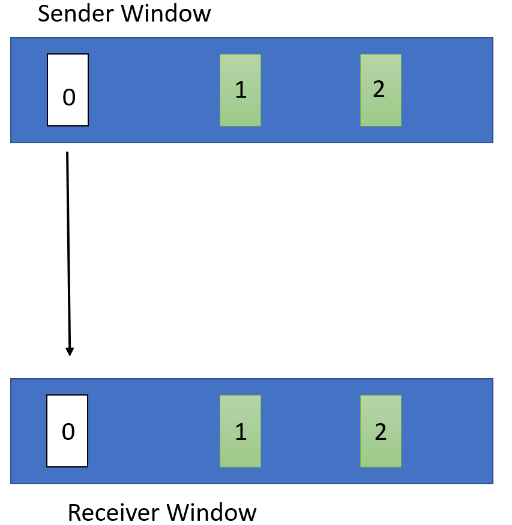

# Assignment 3: Reliable Transport

### Due: April 28, 2023, 11:59 PM HKT

Special notes:
* This is a group assignment with identical grouping information as Assignment 2.
* Before beginning the assignment, it is advisable to thoroughly read through the entire document as subsequent sections may provide valuable insights for earlier ones.

## Table of Contents
* [Overview](#ow)
* [Clarifications](#cl)
* [Part 1:](#1) Implement `wSender`
* [Part 2:](#2) Implement `wReceiver`
* [Part 3:](#3) Optimizations (bonus part)
* [Submission Instructions](#subinstr)
* [Implementation Environment & Autograder](#ag)

<a name="ow"></a>
## Overview

The objective of this project is to develop a simple reliable transport protocol,`WTP`, which operates **on top of UDP**. 
Your implementation of `WTP` must ensure the sequential and reliable delivery of UDP datagrams, even in the face of challenges such as `packet loss, latency, corruption, duplication, and reordering`.

There are a variety of ways to ensure a message is reliably delivered from a sender to a receiver. You are to implement a sender (`wSender`) and a receiver (`wReceiver`) that follows the following `WTP` specification.


### WTP Specification
The data transmission format used by `WTP` consists of a header and a data chunk (data in your tranferred files). The header includes four types: `START`, `END`, `DATA`, and `ACK`, all of which adhere to the following format:

```
struct PacketHeader {
	unsigned int type;     // 0: START; 1: END; 2: DATA; 3: ACK
	unsigned int seqNum;   // Describe afterwards
	unsigned int length;   // Length of data; 0 for ACK, START and END packets
	unsigned int checksum; // 32-bit CRC
}
```

The `PacketHeader`'s `type` and `seqNum` fields can be explained as follows:
1. To establish a connection, `wSender` initiates a `START` message with a random `seqNum` value and awaits an ACK. In `wReceiver`, the ACK `seqNum` values for `START` messages should match the `seqNum` value sent by `wSender`. `wReceiver` then sends this ACK back to `wSender`.
2. Once the connection is established, data transfer may proceed using the `DATA` message type. To transmit packets consecutively, `wSender` sets the initial seqNum to **0** for the first packet after `START`. The `seqNum` of each subsequent transmitted data packet is incremented by one. `wReceiver` should only send back cumulative ACK, which represent the last acknowledged packet within current sliding window. (We will describe silding window afterward.)
3. After the entire file has been transferred, the connection should be terminated with `wSender` sending an `END` message with the same `seqNum` as the `START` message and awaiting the corresponding ACK. The `seqNum` value for the `END` message's ACK in `wReceiver` should match that of `wSender`.

### Packet Size
We will employ Ethernet networks for data transfer, with a maximum frame size of 1500 bytes. When utilizing the implemented `WTP` for data transfer, it is advisable to observe the maximum data size that can be transferred in a single packet. Notably, **UDP**, as a transport layer protocol, has an 8-byte header, while the underlying IP protocol headers across the network, link, and physical layers have a total header size of 20 bytes. Consequently, the available transferred data in a single packet is **1472 bytes** (including the `WTP` header mentioned above).

## Learning Outcomes
Upon completion of this programming assignment, students should be able to:  
* Decribe the operation of different sliding window protocols
* Troubleshoot different kinds of data transmission errors in the network and write applications with reliable data transmission

<a name="cl"></a>
## Clarifications  

* The testing of your program will involve only one `wSender` and one `wReceiver` for all sections.
* You have the flexibility to select how to read from and write to files, but you may find the `std::ifstream.read()` and `std::ofstream.write()` functions, or `mmap` function especially useful.
* You MUST NOT use TCP sockets (and the autograder can detect it).
* If you use single thread, polling on a socket may be helpful for packet receiving and timer implementation. Refer to `MSG_DONTWAIT` in `recvfrom` or `recvmsg` for further information. 
* Stay up-to-date with the latest announcements by following Piazza closely. Further clarifications will be posted on Piazza via pinned Instructor Notes. Also those updates will be synchronized in this GitHub page.

### Hints About Programming
* If you are unsure of the usage of libc functions, please consult their respective `Man pages`. For example, to obtain the definition and usage of recvfrom, enter `man recvfrom` in the terminal.
* Another valuable resource for UDP socket programming is [Beej's Guide to Network Programming Using Internet Sockets](https://beej.us/guide/bgnet/html/index.html).

<a name="1"></a>
## Part 1: Implement `wSender`

### UDP based WTP
`wSender` should read an input file and transmit it to a specified receiver using **UDP** following the WTP protocol described above. The input file should be split into appropriately sized data chunks in each packet, and a `checksum` should be appended to each packet using the 32-bit `CRC` header provided in the starter_files directory. Also, please refer to the WTP specification above to transfer data with its `type` and `seqNum` in the `PacketHeader`.

### Sliding Window and Timeout
This reliable transport will be implemented using a `sliding window` mechanism with a window size (`window-size`) specified in the command line. `wSender` sends all packets in the current sliding window, and `wReceiver` should receive these packets within the **same** window size. `wReceiver` drops packets that are not in sequential `seqNum` and only sends back **cumulative** `ACK`s indicating the last sequentially received packet. In the current implementation, there is no need to send an `ACK` for every individual packet.

To handle situations where data packets are failed to sent or `ACK` packets are not well received by `wSender`, a 500 milliseconds **retransmission timer** will be implemented to automatically retransmit unacknowledged packets. Specifically, when `wSender` transmits all packets in the current window, it starts the timer and waits for `ACK`s. If all `ACK`s are received within 500 milliseconds, we should move the window forward to the unsent packets, reset the timer, and send the new packets in the window. Otherwise, if the timer exceeds 500 milliseconds and `wSender` does not receive all `ACK`s from `wReceiver`, the window moves forward to the first packet that needs to be re-transmitted, then we reset the timer, and send all packets in the current window.

### Reliable Transfer Situations
Under various network abnormal environments, `wSender` is required to ensure reliable data transfer. The tested conditions are outlined in the [autograder](#ag) section.

### Running `wSender`
`wSender` should be invoked as follows:

`./wSender <receiver-IP> <receiver-port> <window-size> <input-file> <log>`

* `receiver-IP`: The IP address of the host on which `wReceiver` is running.
* `receiver-port`: The port number on which `wReceiver` is set to receive files.
* `window-size`: The maximum number of sent packets allowed in one sliding window.
* `input-file`: The path to the file that needs to be transferred, which can be either a text or binary file (e.g., image or video).
* `log`: The file path where the running messages should be logged, which will be described later.

Example: `./wSender 10.0.0.1 8888 10 input.in log.txt`

*Note: During testing and grading, the arguments in the command line exactly match the format shown above. It is crucial to ensure that your implementation can correctly parse the command line arguments in the specified format.*

### Logging
`wSender` should generate a log of its activity, appending the following line to the log after sending or receiving each packet (everything excluding the `data` in the packet structure described earlier):

`<type> <seqNum> <length> <checksum>`

<a name="2"></a>
## Part 2: Implement `wReceiver`

### Receiving Method
`wReceiver` should use a finite loop to prepare to receive any file from `wSender` at any time, and for each new file, a new connection should be created. Furthermore, `wReceiver` can only handle one connection in `wSender` at a time and should ignore `START` messages while in the middle of an existing connection. It is responsible for receiving and storing the file sent by the `wSender` on disk completely and accurately, such as it can be played without any errors if we send a video. The stored file should be named `FILE-i.out`, where `i=0` for the file from the first connection, `i=1` for the second, and so on.

### Packet Corruption Checking
`wReceiver` should also calculate the `checksum` value for the data in each packet it receives using the header mentioned in Part 1. If the calculated checksum value does not match the `checksum` provided in the header, the packet should be dropped, and no `ACK` for this packet should be sent back.

### Manage `seqNum`
After receiving packets in the current window, `wReceiver` sends a cumulative ACK with the `seqNum` it expects to receive next. If it expects a packet of sequence number `N`, the following two scenarios may occur in the next time of receiving packets:
1. If it receives any packet with `seqNum=N` in the window, it sequentially checks the received packets afterwards in the window and obtains the highest in-order packet's `seqNum` (say `M`). The packets with seqNum between `N` and `M` will be received and stored by `wReceiver`, while other packets will be discarded. `wReceiver` then sends an ACK with `seqNum=M+1`.
2. If it does not receive any packet with `seqNum=N` in the window, it sends back an `ACK` with `seqNum=N`.

Additionally, `wReceiver` drops all packets with `seqNum` greater than or equal to `N + window-size` to maintain a `window-size` window. `wReceiver` should also log every single packet it sends and receives using the same format as the `wSender` log.

### Running `wReceiver`
`wReceiver` should be invoked as follows:

`./wReceiver <port-num> <window-size> <output-dir> <log>`

* `port-num`: The port number on which `wReceiver` is set to receive data.
* `window-size`: The maximum number of received packets allowed in one sliding window.
* `output-dir`: The directory where `wReceiver` will store the output files, i.e., the `FILE-i.out` files.
* `log`: The file path where the running messages should be logged as described above.

Example:
`./wReceiver 8888 2 /tmp log.txt`

*Note: During testing and grading, the arguments in the command line exactly match the format shown above. It is crucial to ensure that your implementation can correctly parse the command line arguments in the specified format.*

<a name="3"></a>
## Part 3: Optimizations (Bonus part)

This section requires optimization of `WTP` by modifying the previously written `wSender` and  `wReceiver` programs. Consider the behavior of the earlier programs in the given scenario, which employs a window size of 3:


In this scenario, previous `wReceiver` sends two ACKs with the sequence number set to 0, indicating the next expected packet. Consequently, `wSender` experiences a timeout and retransmits packets 0, 1, and 2. However, since `wReceiver` has already received and buffered packets 1 and 2, there is an avoidable retransmission of these packets.

To address such situations, it is necessary to modify both `wReceiver` and `wSender` programs accordingly (save these revised versions in a folder named `WTP-opt`):

* `wReceiver` will be modified to stop sending cumulative ACKs after the transmission of all data packets in the current window. Instead, it will send back an ACK with `seqNum` set to the same value as the received data packet immediately after receiving each packet. For instance, if the sender sends a data packet with `seqNum` set to 2, `wReceiver` will send back an ACK with `seqNum` set to 2 promptly. However, it will continue to discard all packets with `seqNum` greater than or equal to` N + window_size`, where `N` represents the next expected `seqNum`.

* `wSender` is required to keep track of all the received ACKs within its current window. Consequently, a timeout for packet 0 would not automatically lead to the retransmission of packets 1 and 2. Only packet 0 need to be retransmitted after timeout.

For a better understanding, let us consider an example demonstrating the expected behavior of the optimized `wSender` and `wReceiver` programs in the scenario discussed at the start of this section:


`wReceiver` individually ACKs both packet 1 and 2.



`wSender` receives these ACKs and marks packets 1 and 2 as received in the buffer. It then waits for the 500ms timeout of packet 0 and retransmits only packet 0.

The command line parameters passed to these new `wSender` and `wReceiver` remain the same as those in the previous two sections.

<a name="subinstr"></a>
## Submission Instructions
Your assigned repository must contain:
* `Makefile`(s) to compile all executables (in both basic and bonus parts) with one single `make` command.
* The source code of basic and bonus parts for `WTP`: 
	* Basic part source code for `wSender` and `wReceiver` in part 1&2. (c or cpp code) All source files should be in the folder called `WTP-base`. Binary executables of `wSender` and `wReceiver` should be in the same directory after running `make`.
	* Bonus part source code for `wSender` and `wReceiver` in part 3. (c or cpp code) All source files should be in the folder called `WTP-opt`. Binary executables of `wSender` and `wReceiver` should be in the same directory after running `make`.
* Finally create the required submission tarball named `p3.tar.gz` by running the command `tar acvf p3.tar.gz p3`, where `p3` is the name of your code directory. (To compressed the tarball, you can use `tar axvf p3.tar.gz`).

Example final structure of repository:
```
$ tree -I "<ignore-pattern>" ./p3/
./p3/
├── Makefile <- Compile executables in all directories, supports "make clean" and "make"
├── WTP-base
│   ├── Makefile <- Complile executables in current directory, supports "make clean" and "make"
│   ├── wReceiver <- Binary executable present after running "make"
│   ├── wSender <- Binary executable present after running "make"
│   └── ** source c or cpp files ** 
├── WTP-opt
│   ├── Makefile <- Complile executables in current directory, supports "make clean" and "make"
│   ├── wReceiver <- Binary executable present after running "make"
│   ├── wSender <- Binary executable present after running "make" 
│   └── ** source c or cpp files **
└── starter_files
    ├── PacketHeader.h
    └── crc32.h
```

Your assigned repository must contain:

* The source code for `wSender` and `wReceiver` from parts 1 and 2: all source files should be in a folder called `WTP-base`.
  * Subdirectories for source code within `WTP-base` are perfectly fine, as long as the executables are present after running `make` in `WTP-base`
* The source code for `wSender` and `wReceiver` from part 3: all source files should be in a folder called `WTP-opt`. Subdirectories are fine here too.

<a name="ag"></a>
## Implementation Environment & Autograder
The program is required to ensure reliable data transfer any network condition, and the autograder tests the following aspects of `WTP` (in both basic part and bonus parts):
1. Corruption of packet data (wrong checksum, etc.).  
2. Various levels of packet loss.
3. Duplication of any packet for any amount.
4. Reordering of the packets.
5. Delayed arrival of the packets.
6. Mix of all unreliable conditions above.

Submit the tarball `p3.tar.gz` containing all your code, including the basic and bonus parts, through the autograder (ensure your code directory is named `p3`). Press submit, and your results will show on that page `My Submissions` once grading is finished. The autograder will be released halfway through the assignment.

It's advisable to create your own tests to verify the functionality of your sender and receiver to achieve complete and unaltered file transfers. Relying on autograder to debug your code is not recommended. Instead, you can try local debugging tools like gdb (e.g. `gdb --args ./wReceiver 8888 2 /tmp log.txt`) to debug your code.

*The grading procedure in autograder may be a bit slow, especially when many people submit it together. Please wait patiently for the grading procedure in autograder and reserve sufficient time before deadline. Also, your solution will timeout when there is a heavy burden in autograder, but that may not mean your code is wrong. Please re-submit it to see whether the same test case will have the same error, and do not wait until late near deadline to submit your code.*

The autograder runs the following versions of gcc/g++, please make sure your code is compatible.
```
$ gcc --version
gcc (Ubuntu 11.2.0-16ubuntu1) 11.2.0
Copyright (C) 2021 Free Software Foundation, Inc.
This is free software; see the source for copying conditions.  There is NO
warranty; not even for MERCHANTABILITY or FITNESS FOR A PARTICULAR PURPOSE.

$ g++ --version
g++ (Ubuntu 11.2.0-16ubuntu1) 11.2.0
Copyright (C) 2021 Free Software Foundation, Inc.
This is free software; see the source for copying conditions.  There is NO
warranty; not even for MERCHANTABILITY or FITNESS FOR A PARTICULAR PURPOSE.
```

This assignment does not require specific environment dependencies, as long as you use `c` or `cpp` language to implement your code, and ensure that your `gcc` and `g++` versions are compatible with version `11.2.0` as the autograder shows. You can complete this assignment by using the same environment from Assignment 1's with virtual box or download the corresponding environment [link](https://drive.google.com/file/d/1tZ7npPzruhB1bOCKY7huow_i8PwH72bC/view?usp=share_link) (`csci4430` for both username and password) for VMware machine used in Assignment 2 if you like.

## Acknowledgements
This programming assignment is based on Assignment 3 from Umich EECS 489: Computer Networks, and Project 2 from UC Berkeley EE 122: Introduction to Communication Networks.
